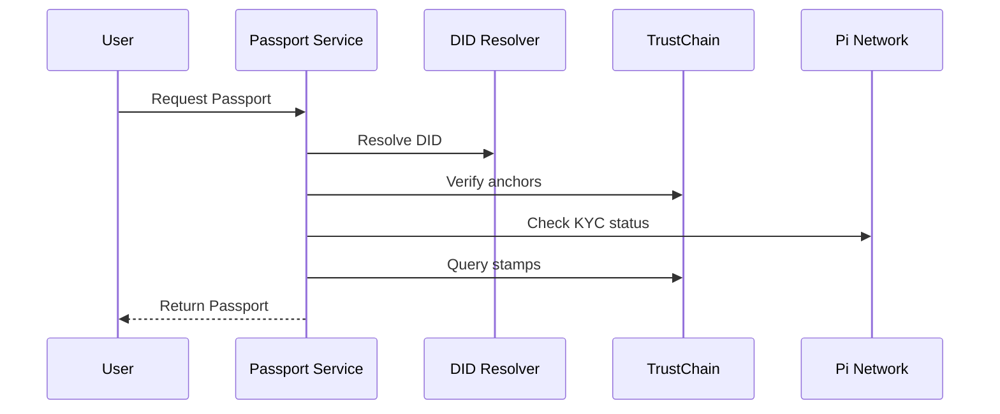

# Passport System

User-facing identity document for agents and humans.

## Overview

The Passport is the user-facing identity document that aggregates:
- Verified identity (DID + KYC)
- Trust score & reputation
- Stamps (achievements/credentials)
- Agent status

## Passport Structure

```typescript
interface Passport {
  username: string
  walletAddress: string
  piWalletAddress: string
  did: string
  tier: string
  xp: number
  trustScore: number
  kyaStatus: string
  kycStatus: string
  stamps: Stamp[]
  issuedDate: string
  agentName: string | null
  agentStatus: string | null
  agentPublicKey: string | null
}

interface Stamp {
  type: string
  provider: string
  verified: boolean
  earnedAt: string
  metadata?: Record<string, any>
}
```

## Passport Tiers

| Tier | Trust Score | Requirements |
|------|-------------|--------------|
| Pioneer | 0-39 | Basic KYC |
| Contributor | 40-59 | +5 stamps |
| Builder | 60-79 | +15 stamps + 100 XP |
| Sovereign | 80+ | 30+ stamps + 1000 XP + 90% trust |

## Stamp Types

| Type | Provider | Description |
|------|----------|-------------|
| KYC_BOUND | Pi Network | KYC verified |
| WALLET_AGE | Stellar | Wallet age > 1 year |
| SKILL_CERT | Skill Registry | Certified skill |
| TRUST_ANCHOR | TrustChain | Anchored to Pi Network |
| DEV_CONTRIB | PAI Core | Code contributions |

## Verification Flow



## API

### Get Passport
```bash
GET /api/v1/passport/:username
```

Response:
```json
{
  "success": true,
  "data": {
    "username": "pioneer.username",
    "walletAddress": "GD5TABC",
    "piWalletAddress": "GA456DEF",
    "did": "did:agent:pi:pioneer.username",
    "tier": "Sovereign",
    "xp": 1250,
    "trustScore": 98,
    "kyaStatus": "VERIFIED",
    "kycStatus": "VERIFIED",
    "stamps": [
      { "type": "KYC_BOUND", "provider": "pi", "verified": true, "earnedAt": "2026-01-01T00:00:00Z" },
      { "type": "WALLET_AGE", "provider": "stellar", "verified": true, "earnedAt": "2025-06-01T00:00:00Z" }
    ],
    "issuedDate": "2026-01-01T00:00:00Z",
    "agentName": "MyAgent",
    "agentStatus": "ACTIVE",
    "agentPublicKey": "z6Mk..."
  }
}
```

## Tier Benefits

| Tier | Trust Score | Benefits |
|------|-------------|----------|
| Pioneer | 0-39 | Basic access |
| Contributor | 40-59 | Skill marketplace access |
| Builder | 60-79 | Priority support, higher rate limits |
| Sovereign | 80+ | Priority support, governance voting, revenue share |

## Stamp Verification

```typescript
async function verifyStamp(stamp: Stamp): Promise<boolean> {
  // 1. Verify provider signature
  const valid = await verifySignature(
    stamp.provider,
    stamp.signature,
    stamp.data
  )
  
  // Check expiration
  if (stamp.expiresAt && stamp.expiresAt < Date.now()) {
    return false
  }
  
  // Check revocation
  const revoked = await checkRevocation(stamp.id)
  if (revoked) return false
  
  return true
}
```

## Integration

```typescript
import { AxiomSDK } from '@axiomid/sdk'

const sdk = new AxiomSDK({ network: 'mainnet' })
const passport = await sdk.getPassport('pioneer.username')

if (passport.tier === 'Sovereign') {
  // Grant premium features
}
```

## Stamp Registry

| Type | Provider | Verification |
|------|----------|--------------|
| KYC_BOUND | Pi Network | Pi Network KYC |
| WALLET_AGE | Stellar | Blockchain query |
| SKILL_CERT | Skill Registry | Signature verification |
| TRUST_ANCHOR | TrustChain | Merkle proof |
| DEV_CONTRIB | PAI Core | GitHub verification |

## Next Steps

- [TrustChain](/guide/trustchain)
- [DID Method](/guide/did-method)
- [API Reference](/reference/api-reference)
EOF